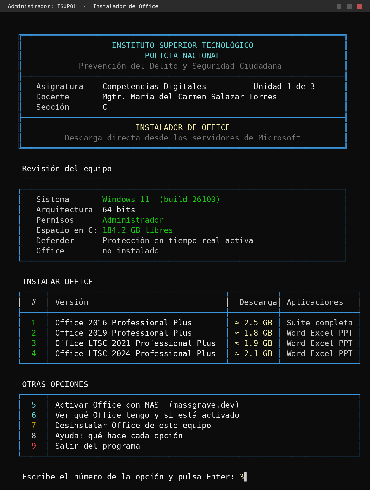

# Instalador de Office · ISUPOL

Instituto Superior Tecnológico Policía Nacional
Tecnología Superior Universitaria en Prevención del Delito y Seguridad Ciudadana

**Asignatura:** Competencias Digitales · Unidad 1 de 3
**Docente:** Mgtr. María del Carmen Salazar Torres · **Sección:** C

Instala Office descargándolo directamente de los servidores de Microsoft
(`officecdn.microsoft.com` y `c2rsetup.officeapps.live.com`). No usa páginas de
terceros ni archivos de dudosa procedencia.

Material educativo para practicar en laboratorio.



---

## Forma 1 · Un solo comando

Abre **PowerShell como administrador** (tecla Windows → escribe `PowerShell` →
clic derecho → *Ejecutar como administrador*) y pega:

```powershell
irm https://raw.githubusercontent.com/MariaDSalazar/instalador-office-isupol/main/office-isupol.ps1 | iex
```

## Forma 2 · Doble clic

1. Descarga `office-isupol.ps1` y `Instalar-Office.cmd` **en la misma carpeta**.
2. Doble clic en `Instalar-Office.cmd`.
3. Acepta el aviso de permisos de administrador.

---

## El menú

| Opción | Qué hace |
|---|---|
| 1 | Office 2016 Professional Plus (suite completa) |
| 2 | Office 2019 Professional Plus (Word, Excel, PowerPoint) |
| 3 | Office LTSC 2021 Professional Plus (Word, Excel, PowerPoint) |
| 4 | Office LTSC 2024 Professional Plus (Word, Excel, PowerPoint) |
| 5 | Activar con MAS ([massgrave.dev](https://massgrave.dev)) |
| 6 | Ver qué Office hay instalado y su estado de licencia |
| 7 | Desinstalar Office |
| 8 | Ayuda |
| 9 | Salir |

## Requisitos

- Windows 10 (build 10240) o Windows 11
- Permisos de administrador
- 5 GB libres en el disco del sistema
- Conexión a internet

El script comprueba los cuatro al arrancar y avisa si falta alguno.

## Detalles técnicos

| Versión | Product ID | Canal / método |
|---|---|---|
| 2016 | `ProPlusRetail` | `c2rsetup.officeapps.live.com` (`version=O16GA`) |
| 2019 | `ProPlus2019Volume` | `PerpetualVL2019` (ODT) |
| 2021 | `ProPlus2021Volume` | `PerpetualVL2021` (ODT) |
| 2024 | `ProPlus2024Volume` | `PerpetualVL2024` (ODT) |

Office 2016 no existe en el Office Deployment Tool moderno, por eso va por otra
ruta. Esa vía no permite excluir aplicaciones, así que instala la suite entera.
Las demás versiones sí quedan solo con Word, Excel y PowerPoint.

## Antivirus

El instalador en sí no debería dar problemas: descarga de dominios de Microsoft
y no hace nada ofuscado. El `.cmd` ejecuta `Unblock-File` para quitar la marca de
"archivo bajado de internet" que si no hace que PowerShell se niegue a abrirlo.

**MAS sí es detectado por Windows Defender**, siempre, por diseño — está
advertido en la propia web de massgrave.dev. El script lo avisa antes de
lanzarlo y explica cómo apagar temporalmente la protección en tiempo real.

## Manual para principiantes

`MANUAL-Instalar-Office.pdf` (13 páginas) explica todo desde encender la
computadora, siguiendo el formato oficial de tareas del Instituto. También está en
`.docx` para editarlo en Word y en `.html`, que es el original del que salen los
otros dos.

Para regenerarlo después de editar el HTML:

```bash
weasyprint MANUAL-Instalar-Office.html MANUAL-Instalar-Office.pdf
```

## Capturas

En `capturas/` están las pantallas del programa:

- `pantalla-pN.png` — limpias
- `figura-NN.png` — con los recuadros rojos numerados que usa el manual

`capturas/render.py` las regenera (`python3 render.py`) y de paso comprueba dos
cosas: que ninguna caja del script quede desalineada, y que cada recuadro del manual
siga apuntando a un texto que existe de verdad en la pantalla.

## Aviso

Activar productos sin pagar la licencia va contra los términos de Microsoft.
Este material es para entender cómo funciona el mecanismo en un entorno de
laboratorio. Al terminar la práctica, restaura el snapshot de la máquina virtual.
